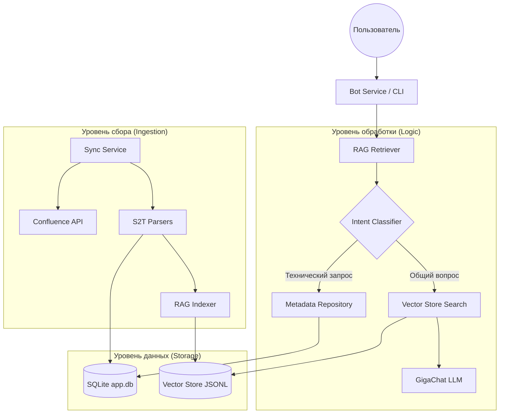

# Архитектура Confluence S2T RAG Bot

Данный документ описывает внутреннее устройство системы, основные компоненты и логику их взаимодействия.

## Общий обзор

Система представляет собой RAG-агента (Retrieval-Augmented Generation), который автоматизирует сбор и анализ документации по витринам данных. Бот объединяет структурированные данные из S2T-файлов (Excel/CSV) и неструктурированные описания из Confluence.

## Ключевые компоненты

### 1. Модуль интеграции (app/confluence)
«Глаза» системы. Отвечает за навигацию по Confluence.
*   **ConfluenceParser:** Рекурсивно обходит дерево страниц. Ищет страницы, названия которых соответствуют паттерну «Витрина...».
*   **Resource Finder:** Находит на страницах ссылки на S2T-файлы, выбирая наиболее актуальные версии на основе дат в названиях или метаданных вложений.

### 2. Парсеры данных (app/s2t)
«Переводчик». Превращает файлы маппингов в программные объекты.
*   **ExcelS2TParser:** Поддерживает сложные многолистовые шаблоны. Извлекает не только состав полей, но и логику трансформации (SQL), типы данных и ответственных (UserName).
*   **Normalization:** Приводит данные из разных форматов к единому стандарту `S2TAttribute`.

### 3. Хранилище (app/storage)
«Память» системы. Состоит из двух частей:
*   **SQLite (Структурированная память):** Хранит «золотой слепок» метаданных. 
    *   `datamarts`: основные данные о витринах.
    *   `attributes`: детальный состав полей из S2T.
    *   `change_log`: история изменений атрибутов.
    *   `s2t_state`: состояние синхронизации файлов (хэши контента).
    *   `page_snapshots`: кэш результатов парсинга страниц Confluence с контролем версий.
*   **Vector Store (Семантическая память):** JSONL-файл с векторными представлениями (эмбеддингами) текстовых описаний. Позволяет искать информацию «по смыслу», а не только по ключевым словам.

### 4. Синхронизация и Diff (app/sync & app/changes)
«Контролер». Обеспечивает актуальность данных.
*   **Incremental Sync:** При каждом запуске сравнивает хэши текущих S2T-файлов в Confluence с локальными. Скачивает и парсит файлы только при наличии изменений.
*   **Diff Service:** При обновлении витрины находит разницу между старым и новым составом атрибутов. Записывает каждое добавление, удаление или изменение в историю.

### 5. Поисковый движок (app/rag)
«Мозг». Решает, как ответить на вопрос пользователя.
*   **Intent Classifier (Диспетчер):** Анализирует вопрос и выбирает путь:
    *   *Технический путь:* Прямой SQL-запрос к SQLite (для вопросов о владельцах, составе полей или истории).
    *   *Генеративный путь (RAG):* Поиск фрагментов в векторной базе + запрос к LLM (GigaChat) для синтеза ответа.
*   **LLM Adapter:** Обертка над GigaChat с встроенной логикой повторных попыток (retries) при сетевых сбоях.

## Жизненный цикл запроса (Data Flow)

1.  **Пользователь** вводит вопрос в CLI или отправляет HTTP-запрос.
2.  **RAGRetriever** через **IntentClassifier** определяет тип запроса.
3.  Если запрос **структурированный** (напр., «Кто владелец витрины Х?»):
    *   Из вопроса извлекается название витрины.
    *   Выполняется запрос к **MetadataRepository**.
    *   Формируется точный ответ на основе данных из SQLite.
4.  Если запрос **генеративный** (напр., «Опиши логику расчета комиссии»):
    *   Вопрос превращается в вектор (embedding).
    *   В **JsonVectorStore** ищутся 5 наиболее похожих фрагментов текста.
    *   Вопрос + найденный контекст отправляются в **LLM**.
    *   LLM генерирует связный текст ответа.
5.  **Пользователь** получает ответ вместе со списком источников (ссылки на Confluence, имена S2T-файлов).

## Схема взаимодействия модулей

## Преимущества архитектуры

1.  **Точность:** Прямое использование БД для метаданных исключает ошибки нейросети там, где нужен строгий факт.
2.  **Эффективность:** Инкрементальное обновление экономит трафик и время, не перекачивая гигабайты неизменной документации.
3.  **Прозрачность:** Каждый ответ сопровождается ссылками на первоисточники, что позволяет верифицировать информацию.
4.  **Устойчивость:** Механизмы повторных попыток и локальное кэширование позволяют работать даже при временной недоступности внешних API.
