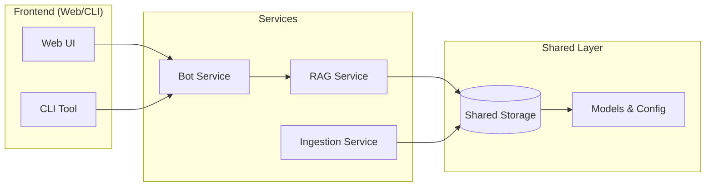

# Архитектура Confluence S2T RAG Bot

Данный документ описывает внутреннее устройство системы, основные компоненты и логику их взаимодействия в рамках микросервисной структуры.

## Общий обзор

Система построена на принципах **модульного монолита**, подготовленного к разделению на микросервисы. Каждый логический блок (Service) изолирован и взаимодействует с другими через четко определенные интерфейсы или общие модели данных.

## Структура сервисов

### 1. Ingestion Service (`services/ingestion`)
Отвечает за «добычу» данных.
*   **Confluence Client:** Навигация и поиск страниц по паттернам.
*   **S2T Parsers:** Извлечение структурированной информации из Excel/CSV.
*   **Sync Logic:** Контроль изменений на основе хэш-сумм, обеспечивающий инкрементальное обновление.

### 2. RAG Service (`services/rag`)
«Интеллектуальное ядро».
*   **Retriever:** Комбинированный поиск (Vector + SQL).
*   **Intent Classifier:** Определение того, нужен ли пользователю точный технический ответ из БД или общее описание от LLM.
*   **LLM Provider:** Интеграция с GigaChat.

### 3. Bot & API Service (`services/bot`)
Уровень представления и внешних интерфейсов.
*   **FastAPI Gateway:** Обработка HTTP-запросов от Web UI.
*   **Adapters:** Поддержка различных каналов коммуникации (CLI, Web, Messenger).

### 4. Shared Layer (`shared/`)
Общие компоненты, обеспечивающие единство системы.
*   **Storage:** Единый слой доступа к данным.
    *   **SQLite:** Основное структурированное хранилище (метаданные, атрибуты, история). Служит "Source of Truth" для контента.
    *   **JSONL:** Текстовое представление документов для RAG.
*   **Models:** Pydantic-модели, описывающие сущности системы (Datamart, Attribute, SyncState).

## Стратегия хранения и векторного поиска

В проекте сознательно используется **гибридный подход** к хранению векторов:

1.  **Разделение контента и индексов:** В базе данных (SQLite) и файлах (JSONL) хранятся только текст и метаданные. Сами многомерные векторы (эмбеддинги) не сохраняются в основную БД.
2.  **On-the-fly Embeddings:** В текущей реализации `JsonVectorStore` вычисляет семантическое сходство (similarity) в момент запроса. 
    *   *Почему:* Это позволяет менять модель эмбеддингов без необходимости переиндексации всей базы данных и обеспечивает 100% прозрачность — вы всегда видите, какой текст был использован.
3.  **Производительность:** Для текущего объема документации (тысячи фрагментов) линейный поиск с вычислением сходства обеспечивает достаточную скорость (сотни мс), избавляя от сложности поддержки тяжелых векторных СУБД (ChromaDB, Pinecone).

## Data Flow (Жизненный цикл данных)

1.  **Ingestion:** Данные скачиваются из Confluence -> Парсятся -> Сохраняются в Shared Storage.
2.  **Indexing:** Текстовые описания из Shared Storage превращаются в векторы и сохраняются в Vector Store.
3.  **Request:** Пользователь задает вопрос через Bot Service.
4.  **Processing:** RAG Service извлекает контекст из Shared Storage и формирует ответ через LLM.
5.  **Response:** Пользователь получает ответ с указанием первоисточников.

## Схема взаимодействия

```mermaid
graph LR
    subgraph "Frontend (Web/CLI)"
        UI[Web UI]
        CLI[CLI Tool]
    end

    subgraph "Services"
        Bot[Bot Service]
        Ingest[Ingestion Service]
        RAG[RAG Service]
    end

    subgraph "Shared Layer"
        Storage[(Shared Storage)]
        Models[Models & Config]
    end

    UI --> Bot
    CLI --> Bot
    Bot --> RAG
    RAG --> Storage
    Ingest --> Storage
    Storage --> Models
```
